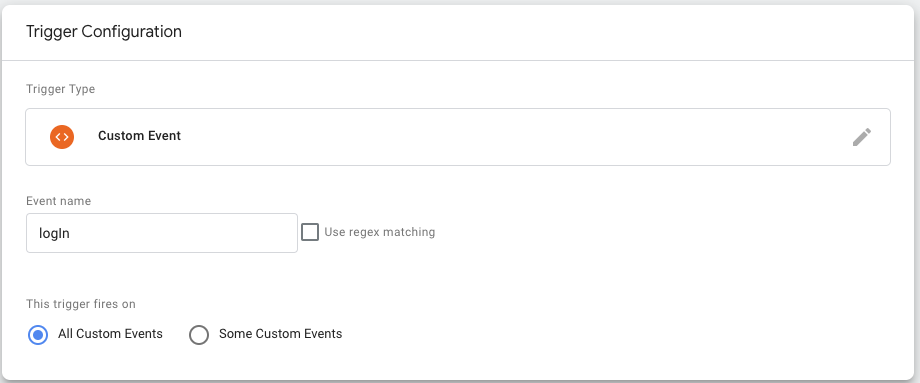

# GTM Tag, Event, Trigger

## GTM Trigger
- Trigger는 event를 감지하고 조건에 맞는 event가 발생하면 Tag를 발동(Fire) 시켜준다

- import package:  React-gtm-module
    - https://www.npmjs.com/package/react-gtm-module

## 1. 이벤트를 포함한 arguments(인수) 정의
App.js
~~~ javascript
const tagManagerArgs = {
    gtmId: GTM_ID,
    events: {
        logIn: 'Log in',
        signUp: 'Sign Up',
    }
}

TagManager.initialize(tagManagerArgs);
~~~

## 2. dataLayer 함수 호출
Page.js or Call function
~~~ javascript
TagManager.dataLayer({
    dataLayer: {
        event: 'Log in', // 이벤트명
        // add more data
    }
});
~~~

## 3. GTM 에서 Trigger type 에서 정의된 event 사용

- 

- GTM 에서 확인이 필요할듯?

- 참고 : https://goo-gy.github.io/2021-04-28-google-tag-manager